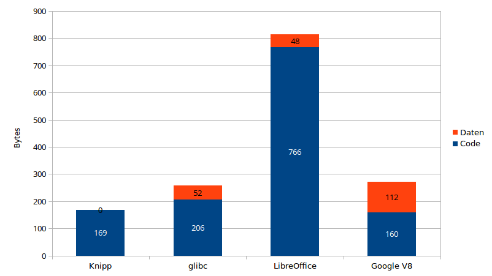
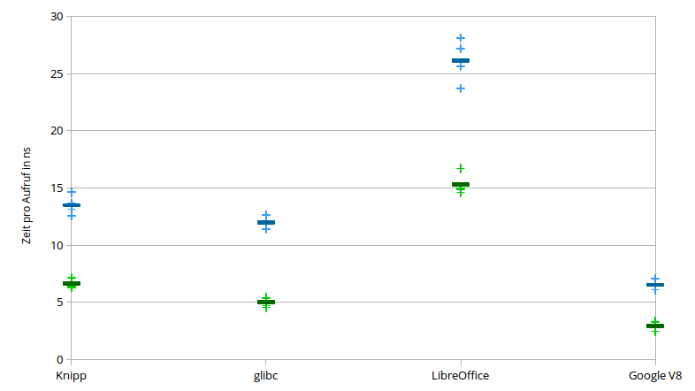

# date-performance-evaluation

This project compares the get-days-from-date algorithms of some projects:

* My own algorithm, which uses only integer operations: + - * / %
* The relevant part of the mktime implementation of glibc
* The Date::DateToDays function of LibreOffice
* The relevant part of DateCache::DaysFromYearMonth of Google V8 JavaScript engine

## Results

### Size comparison

Shows the size of the generated binary: The code in blue, the read-only data in orange.

### Performance comparison

Shows the time per call in nanoseconds.

